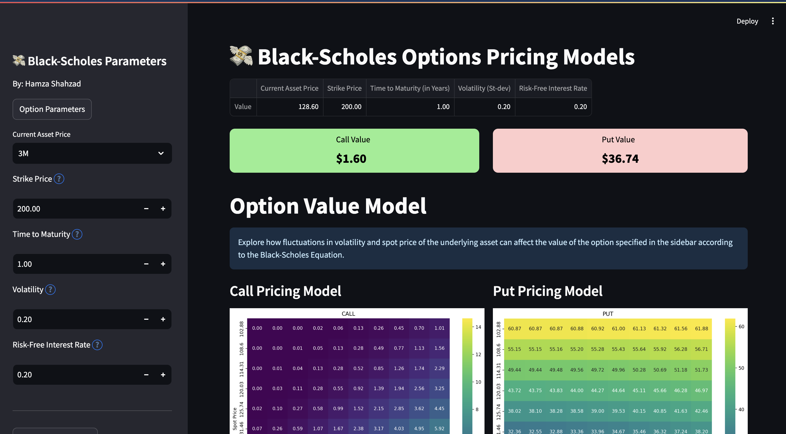

# Black-Scholes Option Pricing Model (Dynamic)
This application renders an interactive display wherein the user can enter specified parameters
related to the option and it's underlying asset (volatility, time to maturity, asset price etc.) 
which are then fed to a Black-Scholes Model to compute the current value of the put and call option. 

The proceeding options pricing models documents, via a heatmap, the variance of the Black-Scholes option valuation over a range of volatilities and spot (current) prices. A section is also included which
graphically documents via a heatmap the variance of the investor's prospective P&L (Profit and Loss) baed on the current market price of the specified option. 

The user may select, as the underlying asset, any equity from the S&P500 index. The current price of this
equity is fetched from a live-market API which can be fed into the pricing model dynamically. 

## P&L Heatmap Intuition
P&L on the option is calculated as the difference between the valuation of the option as calculated
using the Black-Scholes Model and the current market price. The trader makes a prospective profit 
if the option is currently undervalued by the market and makes a prospective loss if the 
option is currently overvalued by the market. The valuation of the option varies in direct
correlation with the volitility and spot price of the asset - this variance is graphically
represented using the P&L Heatmaps. 

The heatmaps in the first section represent the general option value variance in direct 
correlation with teh volitility and spot price of the asset. These computations are used
as a prelude to the P&L computation. 

## File Structure
- BSModel.py contains the BlackScholes object which performs computations related to valuation and
P&L calculations. 
- heatmap.py contains methods to generate each variant of the heatmap
- utils.py contains various utility functions abstracted away from the index.py file
- styles.py applies css styling to the streamlit application
- index.py is the high-level application interface which organizes the information
- sp500name.csv and sp500ticker.csv contain current data related to the S&P500 index 

## Future Extensions
- Will integrate optionality to fetch live pricing information on other asset classes (commodities, 
fixed-income etc.)
- Will integrate optionality to compute the P&L on options currently live on the Chicago Board Options
Exchange 
- Provide alternative option pricing models (e.g. Binomial)
